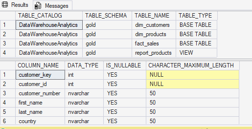
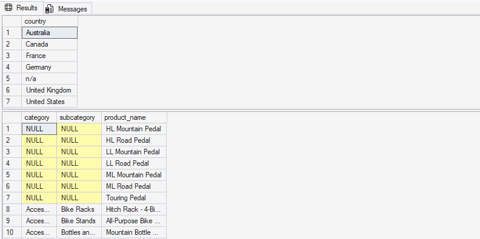
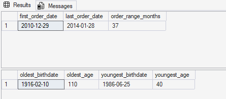
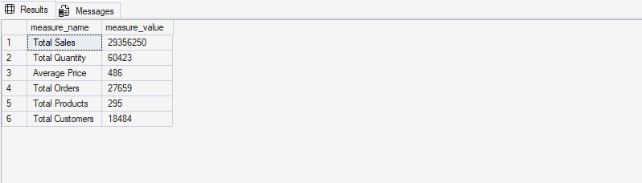
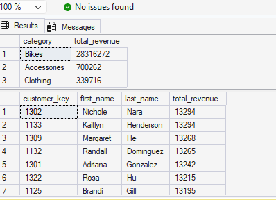
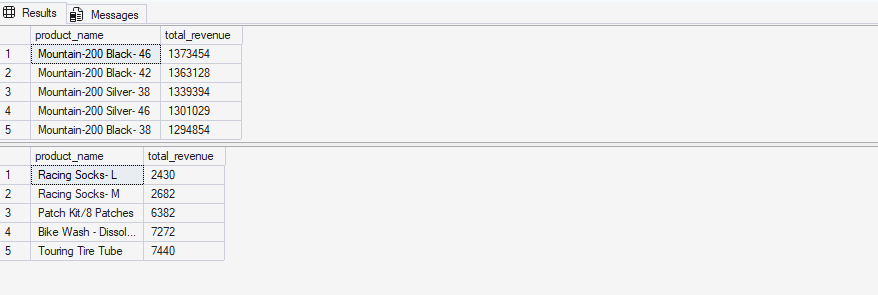

# E-Commerce Sales EDA: Database & Business Metrics Exploration
### Exploratory Data Analysis Using SQL

---

## Abstract

Before you can extract insight from data, you need to understand what you're actually working with.

This is Part 1 of a two-part SQL analytics series on a real-world e-commerce dataset. Before any business questions get answered, the data gets interrogated — its structure, its range, its quirks, its quality issues. What tables exist? What time period does it cover? What are the headline numbers? Only after answering those questions does it make sense to push into deeper analysis.

That's the whole point of EDA. Know your data before you draw conclusions from it.

---

## Section 1 — Introduction & Problem Statement

### 1.1 Background

Jumping straight into advanced analysis without first exploring the dataset is one of the most common mistakes analysts make. You end up building conclusions on assumptions you never actually verified — and that's where things quietly go wrong.

This project takes the opposite approach. Every table gets inspected. Every dimension gets counted. Every data quality issue gets flagged. It's not the flashiest work, but it's the work that makes everything else trustworthy.

### 1.2 Problem Statement

Working with an e-commerce dataset containing customer, product, and sales records, the goal is to build a reliable analytical foundation by answering six core questions:

- What's the structure and schema of the database?
- What are the unique dimensions — countries, categories, products — that define this business?
- What time period does the data cover, and what's the demographic range of the customer base?
- What are the headline business metrics at a high level?
- How does performance distribute across countries, genders, and product categories?
- Who and what are the top and bottom performers?

### 1.3 Research Objectives

Six progressive exploration steps:

1. Understand the database structure.
2. Map out the unique dimensions of the business.
3. Establish the temporal and demographic boundaries of the data.
4. Calculate the key business metrics.
5. Understand how those metrics distribute across categories and geographies.
6. Identify top and bottom performers by revenue and orders.

---

## Section 2 — Methodology & Tools

### 2.1 Dataset

The dataset follows a **Gold Layer architecture** — pre-cleaned, business-ready tables built for analysis:

| File | Description |
|---|---|
| `gold.dim_customers.csv` | Customer demographics — names, countries, birthdates |
| `gold.dim_products.csv` | Product catalog — categories, subcategories, costs |
| `gold.fact_sales.csv` | Sales transactions — orders, quantities, revenue |

> Gold Layer means these tables have already been through cleaning and transformation. They're analysis-ready — but as this EDA shows, even clean data can hide issues worth flagging.

### 2.2 Analytical Approach

| Layer | Focus |
|---|---|
| Database Exploration | Schema, tables, column metadata |
| Dimensions Exploration | Unique values across key dimensions |
| Date Range Exploration | Temporal boundaries and customer age range |
| Measures Exploration | Headline KPIs and business metrics |
| Magnitude Analysis | Distribution across categories and geographies |
| Ranking Analysis | Top and bottom performers by revenue and orders |

### 2.3 Project Scripts

| Script | Purpose |
|---|---|
| `01_database_exploration.sql` | Inspect database structure and column metadata |
| `02_dimensions_exploration.sql` | Explore unique countries, categories, and products |
| `03_date_range_exploration.sql` | Determine data time range and customer age boundaries |
| `04_measures_exploration.sql` | Calculate headline business KPIs |
| `05_magnitude_analysis.sql` | Aggregate metrics by country, gender, and category |
| `06_ranking_analysis.sql` | Rank top and bottom products and customers |

### 2.4 Tools Used

| Tool | Purpose |
|---|---|
| SQL Server (T-SQL) | Core query language |
| SSMS | Query execution and result inspection |
| INFORMATION_SCHEMA | Database metadata exploration |
| Window Functions | Flexible ranking and comparative analysis |
| Git & GitHub | Version control and portfolio sharing |

---

## Section 3 — Analysis & Results

### 3.1 Database Exploration
📄 *Script: `01_database_exploration.sql`*

First thing — understand what the database actually contains. That means inspecting all available tables and their column structures using system metadata views before writing a single analytical query.

```sql
-- Database Tables
SELECT
    TABLE_CATALOG,
    TABLE_SCHEMA,
    TABLE_NAME,
    TABLE_TYPE
FROM INFORMATION_SCHEMA.TABLES;

-- Column Structure for dim_customers
SELECT
    COLUMN_NAME,
    DATA_TYPE,
    IS_NULLABLE,
    CHARACTER_MAXIMUM_LENGTH
FROM INFORMATION_SCHEMA.COLUMNS
WHERE TABLE_NAME = 'dim_customers';
```

**Result:**


**Findings:**

The database has **4 objects** in the `gold` schema — three core tables (`dim_customers`, `dim_products`, `fact_sales`) and one VIEW (`report_products`). Clean dimensional model, no surprises there.

The `dim_customers` structure confirms the key fields we need: `customer_key`, `customer_id`, `customer_number`, `first_name`, `last_name`, `country` — all the dimensions that matter for customer-level analysis.

---

### 3.2 Dimensions Exploration
📄 *Script: `02_dimensions_exploration.sql`*

With the structure confirmed, the next step is understanding what unique values actually exist across the key dimensions — the building blocks of any segmentation or filtering work downstream.

```sql
-- Unique Countries
SELECT DISTINCT country
FROM gold.dim_customers
ORDER BY country;

-- Unique Categories, Subcategories and Products
SELECT DISTINCT
    category,
    subcategory,
    product_name
FROM gold.dim_products
ORDER BY category, subcategory, product_name;
```

**Result:**


**Findings:**

The customer base spans **7 geographic entries** — Australia, Canada, France, Germany, United Kingdom, and United States — plus one entry recorded as `n/a`, which got flagged immediately for data quality review.

> ⚠️ **Data Quality Flag:** The `category` and `subcategory` columns returned **NULL values** for a subset of product entries. This is either incomplete data entry at the source or products that weren't assigned to a category yet. Either way, it's documented and needs to be resolved before any product category-level analysis runs. Finding this early is exactly what EDA is for.

---

### 3.3 Date Range Exploration
📄 *Script: `03_date_range_exploration.sql`*

Before any trend or time-series analysis, you need to know exactly what time window you're working with — and whether the customer demographic data makes sense.

```sql
-- First and Last Order Date
SELECT
    MIN(order_date) AS first_order_date,
    MAX(order_date) AS last_order_date,
    DATEDIFF(MONTH, MIN(order_date), MAX(order_date)) AS order_range_months
FROM gold.fact_sales;

-- Youngest and Oldest Customer
SELECT
    MIN(birthdate) AS oldest_birthdate,
    DATEDIFF(YEAR, MIN(birthdate), GETDATE()) AS oldest_age,
    MAX(birthdate) AS youngest_birthdate,
    DATEDIFF(YEAR, MAX(birthdate), GETDATE()) AS youngest_age
FROM gold.dim_customers;
```

**Result:**


**Findings:**

The dataset covers **37 months of transaction history**, from **December 29, 2010** to **January 28, 2014** — a solid window for trend and seasonality work.

Customer ages range from **40** (youngest, born June 25, 1986) to **110** (oldest, born February 10, 1916).

> ⚠️ **Data Quality Flag:** A 110-year-old active e-commerce customer is almost certainly a data entry error. That 1916 birthdate needs to be reviewed and either corrected or excluded from any age-based demographic analysis. Easy to miss if you don't run this check upfront.

---

### 3.4 Measures Exploration — Key Business Metrics
📄 *Script: `04_measures_exploration.sql`*

With structure and boundaries understood, time to calculate the headline numbers — a single consolidated view of the entire business's performance.

```sql
SELECT 'Total Sales' AS measure_name,
    SUM(sales_amount) AS measure_value FROM gold.fact_sales
UNION ALL
SELECT 'Total Quantity', SUM(quantity) FROM gold.fact_sales
UNION ALL
SELECT 'Average Price', AVG(price) FROM gold.fact_sales
UNION ALL
SELECT 'Total Orders',
    COUNT(DISTINCT order_number) FROM gold.fact_sales
UNION ALL
SELECT 'Total Products',
    COUNT(DISTINCT product_name) FROM gold.dim_products
UNION ALL
SELECT 'Total Customers',
    COUNT(customer_key) FROM gold.dim_customers;
```

**Result:**


**Findings:**

| Metric | Value |
|---|---|
| Total Sales | **$29,356,250** |
| Total Quantity Sold | **60,423 units** |
| Average Price | **$486** |
| Total Orders | **27,659** |
| Total Products | **295** |
| Total Customers | **18,484** |

These are the baselines. Every segment, category, or ranking finding in the rest of the analysis gets interpreted relative to these numbers.

---

### 3.5 Magnitude Analysis
📄 *Script: `05_magnitude_analysis.sql`*

With headline metrics set, the next question is how performance actually distributes across the key dimensions — countries, genders, and product categories.

```sql
SELECT
    p.category,
    SUM(f.sales_amount) AS total_revenue
FROM gold.fact_sales f
LEFT JOIN gold.dim_products p
    ON p.product_key = f.product_key
GROUP BY p.category
ORDER BY total_revenue DESC;
```

**Result:**


**Findings:**

The revenue split by category is pretty stark:

| Category | Total Revenue |
|---|---|
| Bikes | **$28,316,272** |
| Accessories | **$700,262** |
| Clothing | **$339,716** |

Bikes are carrying roughly **97% of all revenue**. That's not a dominant category — that's the entire business, with everything else as a rounding error. It has real implications for inventory strategy, marketing spend, and risk exposure.

On the customer side, the top spenders are tightly clustered — the highest spender (**Nichole Nara, $13,294**) is separated from the 7th-ranked customer by less than $100. No single dominant customer; fairly even distribution among the top buyers.

---

### 3.6 Ranking Analysis
📄 *Script: `06_ranking_analysis.sql`*

The final layer — identifying the specific products at the top and bottom of performance, using both simple `TOP` queries and window functions for more flexible, reusable ranking logic.

```sql
-- Top 5 Products by Revenue
SELECT * FROM (
    SELECT
        p.product_name,
        SUM(f.sales_amount) AS total_revenue,
        RANK() OVER (ORDER BY SUM(f.sales_amount) DESC) AS rank_products
    FROM gold.fact_sales f
    LEFT JOIN gold.dim_products p
        ON p.product_key = f.product_key
    GROUP BY p.product_name
) AS ranked_products
WHERE rank_products <= 5;

-- Bottom 5 Products by Revenue
SELECT TOP 5
    p.product_name,
    SUM(f.sales_amount) AS total_revenue
FROM gold.fact_sales f
LEFT JOIN gold.dim_products p
    ON p.product_key = f.product_key
GROUP BY p.product_name
ORDER BY total_revenue;
```

**Result:**


**Findings:**

**Top 5 Products by Revenue:**

| Product | Total Revenue |
|---|---|
| Mountain-200 Black-46 | **$1,373,454** |
| Mountain-200 Black-42 | **$1,363,128** |
| Mountain-200 Silver-38 | **$1,339,394** |
| Mountain-200 Silver-46 | **$1,301,029** |
| Mountain-200 Black-38 | **$1,294,854** |

**Bottom 5 Products by Revenue:**

| Product | Total Revenue |
|---|---|
| Racing Socks-L | **$2,430** |
| Racing Socks-M | **$2,682** |
| Patch Kit/8 Patches | **$6,382** |
| Bike Wash-Dissolv... | **$7,272** |
| Touring Tire Tube | **$7,440** |

All five top products are Mountain-200 variants. Every single one. That's not a coincidence — that's a product line carrying the business. The bottom five are all low-cost accessories that combined didn't crack $30K across 37 months of sales.

---

## Section 4 — Key Findings

- The database has **4 objects** in the Gold schema — 3 tables and 1 VIEW — in a clean dimensional model architecture.
- The customer base covers **6 countries** plus one unclassified `n/a` entry flagged for review.
- **Two data quality issues surfaced** — NULL category values in the products dimension and a likely erroneous 1916 birthdate — both documented and flagged before any downstream analysis.
- The dataset spans **37 months** of transactions, from December 2010 to January 2014.
- Total revenue hit **$29,356,250** across **27,659 orders** from **18,484 customers**.
- **Bikes account for ~97% of all revenue ($28.3M)** — the business essentially runs on one category.
- **The Mountain-200 product line owns the top 5 revenue spots** — all five highest-revenue products are Mountain-200 variants.
- Bottom performers are all **low-cost accessories** generating under $7,500 each over the full 37 months.

---

## Section 5 — Recommendations

**1. Fix the Data Quality Issues Before Going Further**

Two flags came out of this EDA — NULL product categories and a 1916 birthdate. These need to be investigated at the source before any production reporting gets built on this dataset. Garbage in, garbage out — and it's much easier to fix now than after dashboards are live.

**2. Take the Bike Concentration Seriously**

97% of revenue in one category is a risk, not just a fun fact. Supply chain disruption, a demand shift, or a strong competitor in the bike space hits the entire business almost immediately. Growing Accessories and Clothing — even modestly — would reduce that exposure.

**3. Protect and Invest in the Mountain-200 Line**

The top 5 revenue products are all Mountain-200 variants. This product line deserves priority treatment in stock levels, marketing, and supplier relationships. Running out of Mountain-200 inventory isn't an operations problem — it's a revenue problem.

**4. Review the Bottom-Performing Accessories**

Products generating under $7,500 over 37 months are barely worth the catalog space. Racing Socks, Patch Kits — each one needs a real decision: discontinue, reprice, or bundle with something higher-value. Keeping them around by default isn't a strategy.

**5. Resolve the n/a Country Entry**

Whether it's a system default, a specific region, or just bad data entry — an `n/a` country record needs to be understood before customers can be properly segmented in geographic analysis.

---

## Section 6 — Conclusion

Good analysis starts with good questions. And good questions start with actually understanding your data.

This project deliberately slows down before speeding up — inspecting the structure, mapping the dimensions, checking the time boundaries, and verifying the headline numbers before drawing any conclusions.

What came out of it was more than just a set of metrics. Two data quality issues got caught that would have silently corrupted downstream analysis. A business almost entirely dependent on one product category and one product line got surfaced early. And the baseline numbers — $29.4M in revenue, 27,659 orders, 18,484 customers — got locked in as the reference point for everything that follows.

That's what EDA is actually for. Not just describing the data — understanding it well enough to trust it.

---

## 📁 Project Structure

```
E-Commerce-Sales-EDA-Database-And-Business-Metrics-Exploration-Using-SQL/
├── datasets/
│   ├── gold.dim_customers.csv
│   ├── gold.dim_products.csv
│   └── gold.fact_sales.csv
├── scripts/
│   ├── 01_database_exploration.sql
│   ├── 02_dimensions_exploration.sql
│   ├── 03_date_range_exploration.sql
│   ├── 04_measures_exploration.sql
│   ├── 05_magnitude_analysis.sql
│   └── 06_ranking_analysis.sql
├── images/
└── README.md
```

> 🔗 This is **Part 1** of a two-part SQL analytics series. For advanced analytics including segmentation, performance analysis, and business reporting, see [Part 2 — Advanced Sales Analytics](https://github.com/DanielSampson/Advanced_SQL_Analytics)
